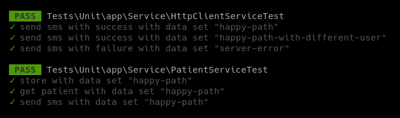

AllView - Clinic Management System

This application is a demo for a clinic management system that allows the user to manage the clinic's patients, doctors,
appointments, and prescriptions. 

The application is built using the Laravel framework with Sail, a light-weight command-line interface for interacting 
with Laravel's default Docker development environment which also brings some nice tools and facilitate the development,
delivery and management of the application.

## Pre-requisites
To start using the application, you need to have Docker and Docker Compose installed on your machine. 

## Installation

1. Clone the repository
2. Enter the project directory `cd allview-clinic`
3. Run the application using the Sail command `./vendor/bin/sail up` to start up the application's containers
    a. Optionally, you can run the application in the background using `./vendor/bin/sail up -d`
    b. Optionally, you can create a temporary alias for the Sail command by typing the command: 
       `alias sail='[ -f sail ] && sh sail || sh vendor/bin/sail'`
    After the alias created, you can use the Sail command by typing `sail up` or `sail up -d` to run the application.
4. Run the migrations using the Sail command `sail artisan migrate` to create the database tables
5. Run the seeders using the Sail command `sail artisan db:seed` to populate the database with some data
6. Access the API documentation using the URL `http://localhost/api/doc`. You can also access the API documentation in
the OpenAPI format using the URL `http://localhost/doc.openapi` or also in the Postman Collection format using the URL
`http://localhost/doc.postman`.

The API documentation also contains some examples of the requests and responses for each endpoint. This examples are
interactive, so you can click on the "Try it out" button and then click on the "Execute" button to see the request and 
the response.

## Usage

This API has 2 main resources: Patients and Records. 

As it is a project which is still in development, the API is not yet fully implemented. Only the endpoints related to 
patients are available:

- GET api/patient/{id}: Returns a specific patient searched by its ID
- POST api/patient: Creates a new patient
- POST api/patient/{id}/sms: Sends an SMS to the patient with the details of the appointment

## Mocking the SMS service

To mock the SMS service a fake SMS server was created. This fake server is a Pact Stub Server that will receive the 
request from the application and will return a response with the details of the SMS that would be sent to the patient if 
the request matches with the Pact file placed on the `/pacts` directory.

For better visibility, the Pact Stub Server is running on a different container. You can see the logs of the Pact Stub
Server by running the command `docker logs allview_stub_server` or running the application in the foreground mode.

## Testing

To run the tests, you can use the Sail command `sail test` or `sail artisan test`. The tests are located in the /tests
directory.

As the application is still in development, only the tests related to the patients are available and currently, only the
unit tests were implemented. The Feature tests should be implemented in the future.

The project currently has 2 main service classes. Then we have 2 unit tests:

- PatientServiceTest: Tests the PatientService class
- HttpClientServiceTest: Tests the HttpClientService class

The tests results are displayed in the terminal like:  

## Logging

The application is configured to log the changes in the database. The logs are stored in the /storage/logs directory.

The logs are getting stored in the following format: `[2023-06-28 10:08:56] local.INFO: Patient created {"id":28}` 
